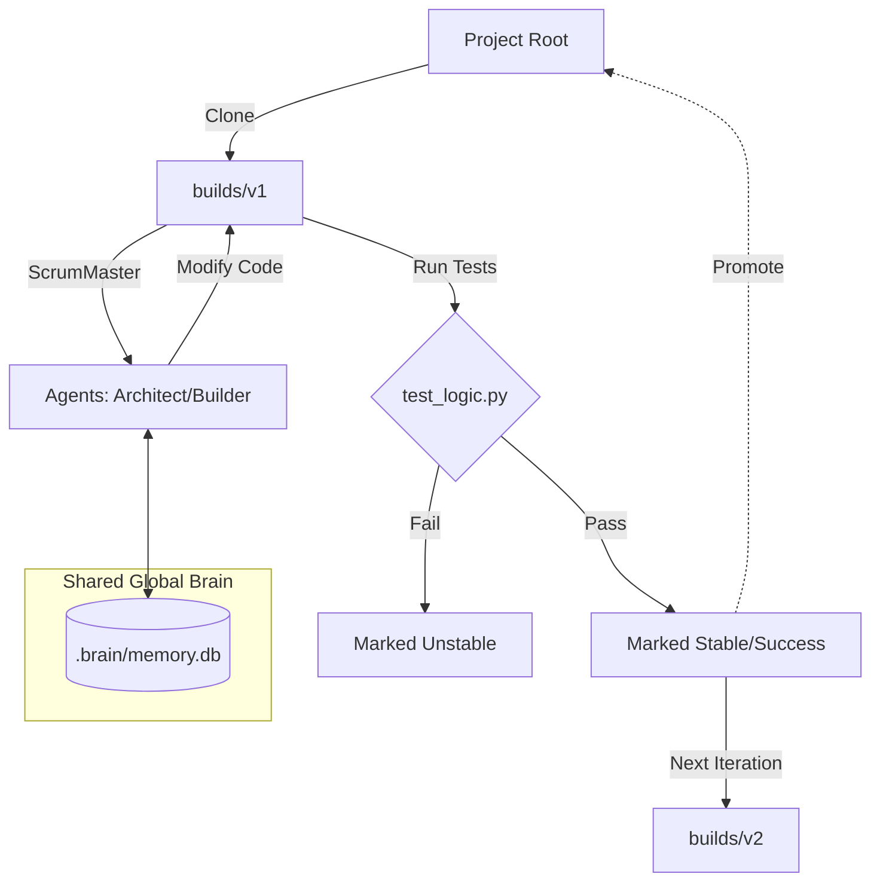

# Operation Ouroboros: Self-Improvement Architecture

## The Concept
**Operation Ouroboros** is the recursive self-improvement capability of the DOC (Dual Orchestrator Core) system. It enables the system to analyze its own source code, design architectural improvements, implement them in safe sandboxed environments, and verify their correctness before adoption. This creates a closed-loop evolutionary cycle where the system becomes progressively more autonomous and robust.

## Architecture

### The Controller: `improve_doc.py`
The `improve_doc.py` script acts as the "God Script" or orchestrator of the entire lifecycle. It is responsible for:
1.  **Version Management**: Creating isolated sandbox environments.
2.  **Memory Orchestration**: Ensuring the agent's knowledge persists across versions.
3.  **Loop Execution**: Triggering the specific missions (Planning -> Execution -> Verification) for each iteration.

### Sandboxing: `builds/vN`
To prevent the system from breaking itself, all modifications occur in strict isolation.
- **Root**: The current "stable" version of the project.
- **`builds/vN`**: A full copy of the repository where agents operate.
- **VersionManager**: This class handles the logic of cloning the *latest stable source* to a new version directory (e.g., `builds/v1`, `builds/v2`). It ensures "Ghost Files" (missing config/docs) are avoided by copying the full repo structure.

### Memory Persistence: Shared Global Brain
A critical feature of Ouroboros is the **Shared Global Brain**. While the code files are versioned and distinct, the memory database (`.brain/memory.db`) is shared globally.
- **Mechanism**: The `ScrumMaster` in every sandbox is forcibly pointed to the absolute path of the root `.brain/memory.db`.
- **Benefit**: This prevents "Amnesia." Lessons learned, skills acquired, and patterns identified in `v1` are immediately available in `v2`, even if `v2` is a fresh start.

## The Workflow (The Loop)

### Step 1: Clone
The `VersionManager` clones the `latest_stable_source` (initially the Root) to a new sandbox directory (e.g., `builds/v1`).

### Step 2: Inject Mission
The Controller injects a high-level prompt into the `ScrumMaster`.
- **Initial Prompt**: Focuses on architectural analysis and refactoring.
- **Subsequent Prompts**: Focus on iterative improvement and reviewing the previous refactor.

### Step 3: Agent Execution
Inside the sandbox, the `ScrumMaster` orchestrates the agents:
- **ARCHITECT (Claude)**: reads the `repo_map.txt` and `ARCHITECTURE.md`, then designs a plan.
- **BUILDER (Codex)**: writes the code changes.
- **REVIEWER (Claude)**: performs a QA pass.

### Step 4: Verification (The Gatekeeper)
The **Gatekeeper** is the test suite (specifically `src/doc/backend/test_logic.py`).
- It is executed automatically after the build phase.
- It verifies that the logic holds together (e.g., agents are assigned correct roles, loop limits are respected).
- **Pass**: The version is marked as a potential Success.
- **Fail**: The version is marked Unstable and typically discarded or ignored.

### Step 5: Promotion
If a version passes verification and is deemed superior, it can be promoted.
- **Promotion**: Replacing the Root source code with the contents of the successful `builds/vN` directory.

## Architecture Diagram



## Usage Guide

### Starting the Loop
To initiate the autonomous improvement cycle:

```bash
python improve_doc.py --loops 5
```

This will run 5 iterations, creating up to 5 versions in `builds/`.

### Promotion
Once a stable candidate is identified (e.g., `builds/v2`), it can be promoted to production. This involves:
1.  Verifying the candidate passes tests: `python -m unittest src/doc/backend/test_logic.py` (inside the build dir).
2.  Copying the contents of `builds/v2` to the project root.
3.  Bumping the version in `pyproject.toml`.
4.  Cleaning up the `builds/` directory.

*Note: This process was automated via `promote_v2.py` for the v1.1.0 release.*
